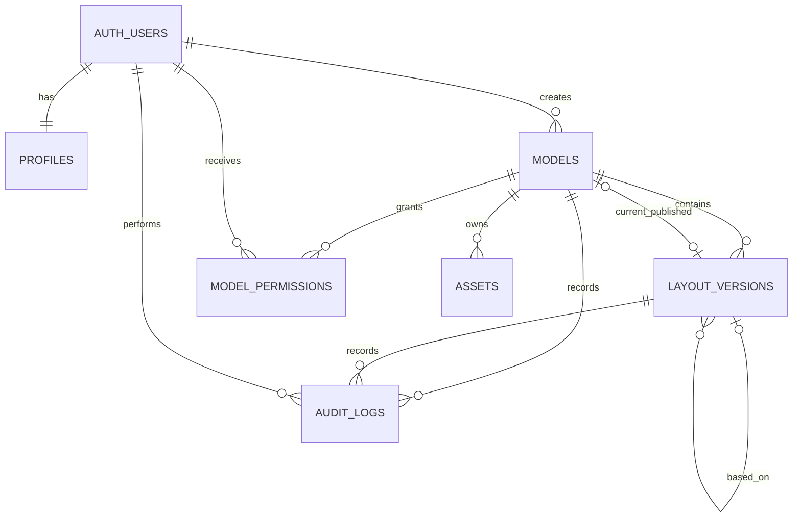

# Supabase backend architecture

## Entity relationships



The layout editor stores one arbitrary editable document in `layout_versions.layout_data`. Binary content belongs in private Storage and is referenced by path/asset ID. Future `processes`, `equipment` and `lob_records` remain separate business tables; layout objects can reference their UUIDs through metadata.

## Version rules

- Save calls `save_layout_version(version_id, expected_revision, layout_data)` and only updates a `DRAFT`.
- The atomic `revision = revision + 1` update includes the expected revision in its predicate. A stale writer receives SQLSTATE `40001`.
- Create New Version calls `create_layout_version`; it copies the source JSON into a new independent `DRAFT` row.
- `PUBLISHED` and `ARCHIVED` versions cannot be saved. Editing starts by creating another draft.
- Publish is an atomic security-definer operation that updates the version, the model's published pointer and the audit log.

## Permission boundary

RLS is enabled on all application tables. Permission lookup is implemented through narrowly scoped `SECURITY DEFINER` helpers with `search_path` fixed to `pg_catalog, public`. Direct mutations of models, versions, permissions, assets metadata and audit rows are revoked from `authenticated`; writes use reviewed RPCs.

- `VIEW`: model/version/assets select.
- `EDIT`: VIEW plus create/save drafts and upload/update model assets.
- `MANAGE`: EDIT plus publish/archive, permissions and asset deletion.
- `ADMIN`: helper functions resolve to MANAGE for every model.

The `factory-assets` bucket is private. Paths begin with the model UUID: `{model_id}/{file}`. Storage RLS derives permission from that first folder.

## Client layering

```text
Existing editor → services/layout-service.js → services/supabase/* → Supabase HTTPS API
```

No drawing module imports Supabase directly. The service is present alongside the legacy persistence and is not yet activated as authoritative storage.
